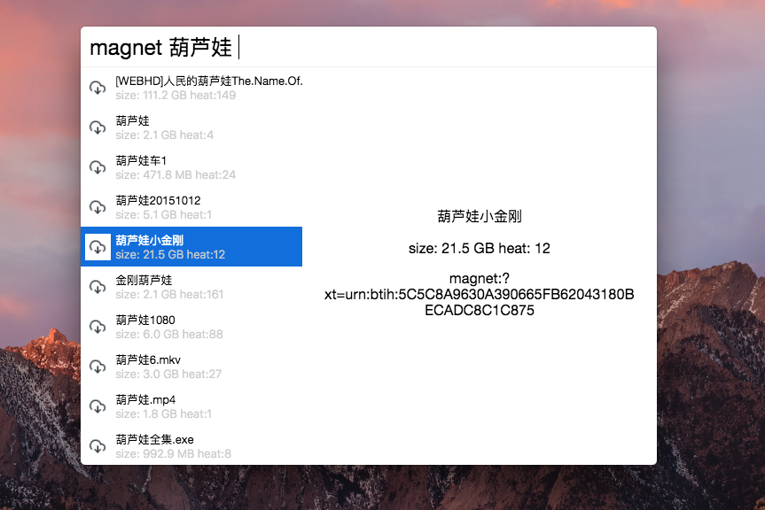

# Cerebro 插件之电影磁力搜索器

> 什么？看个片儿还要打开网页慢慢找?！

这周在学 Node.js, 看了 [@carlos-wong](https://github.com/carlos-wong) 推荐的[《Eloquent JavaScript》](https://eloquentjavascript.net) 这本书的前几章，就抑制不住想写点什么练手。[Cerebro](https://github.com/KELiON/cerebro) 是一个跨平台的快速启动工具（同时支持 Windows、MacOs、Linux），并且可以用 Javascript 定制各种自己喜欢的插件。所以做了一个**电影磁力搜索器**的插件。

## 支持平台

Windows、Linux、MacOS



## 安装步骤

- 确保安装好了 [Cerebro](https://github.com/KELiON/cerebro)

- `Clone` 代码到本地，并执行
    ```shell
    git clone https://github.com/wangshub/cerebro-torrent.git
    cd cerebro-torrent
    yarn install
    ```
- 将 `cerebro-torrent` 文件夹拷贝或者软链接到 `Cerebro` 的 `node_module` 文件夹下；
- 启动 `Cerebro`，输入 `magnets 葫芦娃`，然后敲击 `空格`；
- 稍等片刻，上下选择，敲击回车就可以将磁力链接复制到剪贴板；
- 打开迅雷或者其他下载器，尽情享受吧！

## 原理说明

- 解析输入的指令；
- 利用 async 和 request 库并发爬取网站；
- 嵌入 html 对爬取结果进行显示；

## 代码地址

欢迎 `star ⭐️`  和 `fork 💫` 多提 Issue ！
[wangshub/cerebro-torrent](https://github.com/wangshub/cerebro-torrent)
